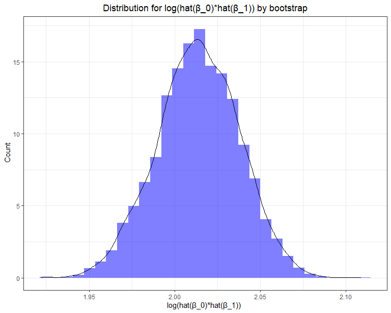

p8105\_hw6\_hy2669
================
haoyang,yi
2020/11/27

## Problem 1

``` r
homicide_df = read_csv('./data/homicide-data.csv')
homicide_df = homicide_df %>%
   mutate(
    city_state = str_c(city, state, sep = ", "),
    victim_age = as.numeric(victim_age),
    resolution = case_when(
      disposition == "Closed without arrest" ~ 0,
      disposition == "Open/No arrest"        ~ 0,
      disposition == "Closed by arrest"      ~ 1)
  ) %>% 
  filter( victim_race %in% c("White", "Black"),
    !city_state %in% c("Tulsa, AL", "Dallas, TX", "Phoenix, AZ", "Kansas City, MO")) %>% 
  select(city_state, resolution, victim_age, victim_race, victim_sex)
```

Start regression on Baltimore, MD

``` r
baltimore_df =
  homicide_df %>% 
  filter(city_state == "Baltimore, MD")
glm(resolution ~ victim_age + victim_race + victim_sex, 
    data = baltimore_df,
    family = binomial()) %>% 
  broom::tidy() %>% 
  mutate(
    OR = exp(estimate),
    CI_lower = exp(estimate - 1.96 * std.error),
    CI_upper = exp(estimate + 1.96 * std.error)
  ) %>% 
  select(term, OR, starts_with("CI")) %>% 
  knitr::kable(digits = 3)
```

| term              |    OR | CI\_lower | CI\_upper |
| :---------------- | ----: | --------: | --------: |
| (Intercept)       | 1.363 |     0.975 |     1.907 |
| victim\_age       | 0.993 |     0.987 |     1.000 |
| victim\_raceWhite | 2.320 |     1.648 |     3.268 |
| victim\_sexMale   | 0.426 |     0.325 |     0.558 |

Run regression models across cities

``` r
models_results_df = 
  homicide_df %>% 
  nest(data = -city_state) %>% 
  mutate(
    models = 
      map(.x = data, ~glm(resolution ~ victim_age + victim_race + victim_sex, data = .x, family = binomial())),
    results = map(models, broom::tidy)
  ) %>% 
  select(city_state, results) %>% 
  unnest(results) %>% 
  mutate(
    OR = exp(estimate),
    CI_lower = exp(estimate - 1.96 * std.error),
    CI_upper = exp(estimate + 1.96 * std.error)
  ) %>% 
  select(city_state, term, OR, starts_with("CI")) 
```

Plot ORs and CIs

``` r
models_results_df %>% 
  filter(term == "victim_raceWhite") %>% 
  mutate(city_state = fct_reorder(city_state, OR)) %>% 
  ggplot(aes(x = city_state, y = OR)) + 
  geom_point() + 
  geom_errorbar(aes(ymin = CI_lower, ymax = CI_upper)) + 
  theme(axis.text.x = element_text(angle = 90, hjust = 0.9)) +
  labs(title = 'Estimates of the OR for solving homicides in US cities')
```


This plot shows that estimates of OR for many cities are above 1 which
is null hypothesis value(No differences between White and Black),
especially in cities such as Boston, Omaha and Oakland. It means that
the odds of a homicide case ending in arrest are greater when the victim
is white compared to Black, which indicates the racial disparity in law
enforcement in many cities (when the victims are White, police may pay
more attention to the case).

## Problem 2.

Load and clean data,convert numerical variables to factor

``` r
birthweight_df = read_csv('./data/birthweight.csv')
birthweight_df = birthweight_df %>%
  mutate_at(c('babysex','frace','mrace','malform'), funs(as.factor)) %>%
  mutate(babysex = factor(babysex,labels = c("male", "female")),
         malform = factor(malform,labels = c("absent", "present"))) # labels of mrace and frace are not changed since some levels of races are missing.
skimr::skim(birthweight_df) # check missing values, results show that there is no NA, but all value of pnumlbw and pnumsga are 0s. Thus these two variables show be removed from dataset.
```

|                                                  |                 |
| :----------------------------------------------- | :-------------- |
| Name                                             | birthweight\_df |
| Number of rows                                   | 4342            |
| Number of columns                                | 20              |
| \_\_\_\_\_\_\_\_\_\_\_\_\_\_\_\_\_\_\_\_\_\_\_   |                 |
| Column type frequency:                           |                 |
| factor                                           | 4               |
| numeric                                          | 16              |
| \_\_\_\_\_\_\_\_\_\_\_\_\_\_\_\_\_\_\_\_\_\_\_\_ |                 |
| Group variables                                  | None            |

Data summary

**Variable type: factor**

| skim\_variable | n\_missing | complete\_rate | ordered | n\_unique | top\_counts                     |
| :------------- | ---------: | -------------: | :------ | --------: | :------------------------------ |
| babysex        |          0 |              1 | FALSE   |         2 | mal: 2230, fem: 2112            |
| frace          |          0 |              1 | FALSE   |         5 | 1: 2123, 2: 1911, 4: 248, 3: 46 |
| malform        |          0 |              1 | FALSE   |         2 | abs: 4327, pre: 15              |
| mrace          |          0 |              1 | FALSE   |         4 | 1: 2147, 2: 1909, 4: 243, 3: 43 |

**Variable type: numeric**

| skim\_variable | n\_missing | complete\_rate |    mean |     sd |      p0 |     p25 |     p50 |     p75 |   p100 | hist  |
| :------------- | ---------: | -------------: | ------: | -----: | ------: | ------: | ------: | ------: | -----: | :---- |
| bhead          |          0 |              1 |   33.65 |   1.62 |   21.00 |   33.00 |   34.00 |   35.00 |   41.0 | ▁▁▆▇▁ |
| blength        |          0 |              1 |   49.75 |   2.72 |   20.00 |   48.00 |   50.00 |   51.00 |   63.0 | ▁▁▁▇▁ |
| bwt            |          0 |              1 | 3114.40 | 512.15 |  595.00 | 2807.00 | 3132.50 | 3459.00 | 4791.0 | ▁▁▇▇▁ |
| delwt          |          0 |              1 |  145.57 |  22.21 |   86.00 |  131.00 |  143.00 |  157.00 |  334.0 | ▅▇▁▁▁ |
| fincome        |          0 |              1 |   44.11 |  25.98 |    0.00 |   25.00 |   35.00 |   65.00 |   96.0 | ▃▇▅▂▃ |
| gaweeks        |          0 |              1 |   39.43 |   3.15 |   17.70 |   38.30 |   39.90 |   41.10 |   51.3 | ▁▁▂▇▁ |
| menarche       |          0 |              1 |   12.51 |   1.48 |    0.00 |   12.00 |   12.00 |   13.00 |   19.0 | ▁▁▂▇▁ |
| mheight        |          0 |              1 |   63.49 |   2.66 |   48.00 |   62.00 |   63.00 |   65.00 |   77.0 | ▁▁▇▂▁ |
| momage         |          0 |              1 |   20.30 |   3.88 |   12.00 |   18.00 |   20.00 |   22.00 |   44.0 | ▅▇▂▁▁ |
| parity         |          0 |              1 |    0.00 |   0.10 |    0.00 |    0.00 |    0.00 |    0.00 |    6.0 | ▇▁▁▁▁ |
| pnumlbw        |          0 |              1 |    0.00 |   0.00 |    0.00 |    0.00 |    0.00 |    0.00 |    0.0 | ▁▁▇▁▁ |
| pnumsga        |          0 |              1 |    0.00 |   0.00 |    0.00 |    0.00 |    0.00 |    0.00 |    0.0 | ▁▁▇▁▁ |
| ppbmi          |          0 |              1 |   21.57 |   3.18 |   13.07 |   19.53 |   21.03 |   22.91 |   46.1 | ▃▇▁▁▁ |
| ppwt           |          0 |              1 |  123.49 |  20.16 |   70.00 |  110.00 |  120.00 |  134.00 |  287.0 | ▅▇▁▁▁ |
| smoken         |          0 |              1 |    4.15 |   7.41 |    0.00 |    0.00 |    0.00 |    5.00 |   60.0 | ▇▁▁▁▁ |
| wtgain         |          0 |              1 |   22.08 |  10.94 | \-46.00 |   15.00 |   22.00 |   28.00 |   89.0 | ▁▁▇▁▁ |

``` r
birthweight_df = select(birthweight_df,-c(pnumsga,pnumlbw))
```

Build my model:

Using stepwise approaches to select a model, the basic principle is
choosing a model by AIC in a stepwise algorithm. This methods develops a
sequence of regression models, at each step adding or deleting a
covariate.

Process: 1. For X1,X2…Xn, where n is the number of potential predictors,
suppose X1 is the first variable added

2.  The next step is to fit all regressions with two X variables, X1
    being one of them.For each regression a t-statistics of the new X is
    obtained

3.  The new X variable with the largest t-stats (smallest p-value) is
    the next candidate.If t-stats \> some predefined level, the second X
    is then added;If not, the program terminates.

4.  Suppose X2 was added second; the procedure now examines whether any
    of the other X variables already in the model should be dropped.The
    X value with the smallest t-stats (highest p-value) is dropped.

5.  Repeat those process until Xn is considered in the model.

<!-- end list -->

``` r
fit1 = lm(bwt ~ ., data = birthweight_df)
step(fit1,trace = 0) # perform stepwise method, do not show the trace history. 
```

    ## 
    ## Call:
    ## lm(formula = bwt ~ babysex + bhead + blength + delwt + fincome + 
    ##     gaweeks + mheight + mrace + parity + ppwt + smoken, data = birthweight_df)
    ## 
    ## Coefficients:
    ##   (Intercept)  babysexfemale          bhead        blength          delwt  
    ##     -6098.822         28.558        130.777         74.947          4.107  
    ##       fincome        gaweeks        mheight         mrace2         mrace3  
    ##         0.318         11.592          6.594       -138.792        -74.887  
    ##        mrace4         parity           ppwt         smoken  
    ##      -100.678         96.305         -2.676         -4.843

Results shows that stepwise method picks bwt \~ babysex + bhead +
blength + delwt + fincome + gaweeks + mheight + mrace + parity + ppwt +
smoken as the selected model.

``` r
fit_birthweight = lm (bwt ~ babysex + bhead + blength + delwt + fincome + 
    gaweeks + mheight + mrace + parity + ppwt + smoken, data = birthweight_df)
```

Make a plot of model residuals against fitted values

``` r
birthweight_df %>%
  add_predictions(fit_birthweight) %>%
  add_residuals(fit_birthweight) %>%
  ggplot(aes(x = pred, y = resid))+ 
  geom_point(alpha = 0.3)+
  geom_smooth(method = 'lm', color = 'red')+
  labs(x = 'fitted values of birthweight', y = 'model residuals', title = 'Model residuals against fitted values')
```

    ## `geom_smooth()` using formula 'y ~ x'


The plot shows that there is no linear relationship between fitted
values and residuals of models since the lm-smooth line is extremely
close to the x-axis. Center of model residuals’ distribution is around
0.

### Make cross validations

Compare my model with two models: fit\_maineffect = lm(bwt \~ blength +
gaweeks ,data = birthweight\_df) fit\_interaction = lm(bwt \~ bhead +
blength + babysex + bhead \* blength + bhead \* babysex + blength \*
babysex + bhead \* blength \* babysex , data = birthweight\_df)

``` r
cv_birthweight = crossv_mc(birthweight_df, 200) %>%
  mutate(train = map(train, as.tibble),
         test = map(test,as.tibble)) # create dataframe with train&test groups.
```

    ## Warning: Problem with `mutate()` input `train`.
    ## i `as.tibble()` is deprecated as of tibble 2.0.0.
    ## Please use `as_tibble()` instead.
    ## The signature and semantics have changed, see `?as_tibble`.
    ## This warning is displayed once every 8 hours.
    ## Call `lifecycle::last_warnings()` to see where this warning was generated.
    ## i Input `train` is `map(train, as.tibble)`.

    ## Warning: `as.tibble()` is deprecated as of tibble 2.0.0.
    ## Please use `as_tibble()` instead.
    ## The signature and semantics have changed, see `?as_tibble`.
    ## This warning is displayed once every 8 hours.
    ## Call `lifecycle::last_warnings()` to see where this warning was generated.

``` r
cv_birthweight = cv_birthweight %>%  # get rmse of each model(build in train group) on test group
    mutate(my_model = map(train,~lm(bwt ~ babysex + bhead + blength + delwt + fincome + 
           gaweeks + mheight + mrace + parity + ppwt + smoken, data = .x)),
           maineffect_model = map(train,~lm(bwt ~ blength + gaweeks, data = .x)),
           interaction_model = map(train,~lm(bwt ~ bhead + blength + babysex + bhead * blength + bhead * babysex + blength * babysex + bhead * blength * babysex, data = .x))) %>% 
  
    mutate(rmse_my_model = map2_dbl(my_model, test, ~rmse(model = .x,data = .y)),
           rmse_maineffect_model = map2_dbl(maineffect_model, test, ~rmse(model = .x,data = .y)),
           rmse_interaction_model = map2_dbl(interaction_model, test, ~rmse(model = .x,data = .y)))
```

    ## Warning: Problem with `mutate()` input `rmse_my_model`.
    ## i prediction from a rank-deficient fit may be misleading
    ## i Input `rmse_my_model` is `map2_dbl(my_model, test, ~rmse(model = .x, data = .y))`.

    ## Warning in predict.lm(model, data): prediction from a rank-deficient fit may be
    ## misleading

    ## Warning: Problem with `mutate()` input `rmse_my_model`.
    ## i prediction from a rank-deficient fit may be misleading
    ## i Input `rmse_my_model` is `map2_dbl(my_model, test, ~rmse(model = .x, data = .y))`.

    ## Warning in predict.lm(model, data): prediction from a rank-deficient fit may be
    ## misleading

``` r
cv_birthweight %>% # make plot of rmse
  dplyr::select(starts_with("rmse")) %>% 
  pivot_longer(
    everything(),
    names_to = "model",
    values_to = "rmse",
    names_prefix = "rmse_"
  ) %>% 
  mutate(model = fct_reorder(model,rmse)) %>% 
  ggplot(aes(x = model, y = rmse)) +
  geom_violin() +
  labs(title = "Comparisons of RMSE in cross validation",
       x = "Model",
       y = "RMSE")
```


This plot shows that my model has the lowest RMSE among three models and
considered as the best model of the three, main effect model has the
highest RMSE and considered as the worst model of the three. Residual vs
fitted value plot (As diagnose of residual’s distribution) and RMSE plot
indicate that my model with stepwise method has relatively good
performance in linear regression of baby’s birthweight.

## Problem 3

Read and tidy the data

``` r
weather_df = 
  rnoaa::meteo_pull_monitors(
    c("USW00094728"),
    var = c("PRCP", "TMIN", "TMAX"), 
    date_min = "2017-01-01",
    date_max = "2017-12-31") %>%
  mutate(
    name = recode(id, USW00094728 = "CentralPark_NY"),
    tmin = tmin / 10,
    tmax = tmax / 10) %>%
  select(name, id, everything())
```

    ## Registered S3 method overwritten by 'hoardr':
    ##   method           from
    ##   print.cache_info httr

    ## using cached file: C:\Users\yihao\AppData\Local\cache/R/noaa_ghcnd/USW00094728.dly

    ## date created (size, mb): 2020-12-04 17:31:43 (7.549)

    ## file min/max dates: 1869-01-01 / 2020-12-31

5000 bootstraps

``` r
bootstrap_df = weather_df %>%
  bootstrap(n = 5000,id = "id") %>%
  mutate(model = map(strap, ~lm(tmax ~ tmin, data = .x)),
         glance_r = map(model, broom::glance),
         tidy_beta = map(model, broom::tidy)) %>%
  unnest(glance_r,tidy_beta) %>%  
  select(id,term,estimate,r.squared) %>%
  mutate(term = recode(term, 
                       "(Intercept)" = "beta_0",
                       "tmin" = "beta_1")) %>%
  select(id,r.squared,term, estimate) %>%
  pivot_wider( names_from = term,
               values_from = estimate) %>%
  mutate(log_beta = log(beta_1 * beta_0)) 
```

distribution of estimate of \(\hat{r^2}\)

``` r
rsquare_plot = bootstrap_df %>%
  ggplot(aes(x = r.squared, y = ..density..))+
  geom_histogram(fill = "blue", alpha = .4) +
  geom_density(aes( x = r.squared, y = ..density..)) +
  theme_bw() +
  labs(title = "Distribution for r^2 estimate by bootstrap",
       x = "estimate of r^2",
       y = " Count") +
  theme(plot.title = element_text(hjust = .5 ))
rsquare_plot
```

    ## `stat_bin()` using `bins = 30`. Pick better value with `binwidth`.


distribution of \(log(\hat{\beta_0}*\hat{\beta_1})\)

``` r
logtrans_plot = bootstrap_df %>%
  ggplot(aes(x = log_beta, y = ..density..))+
  geom_histogram(fill = "blue", alpha = .5) +
  geom_density(aes( x = log_beta, y = ..density..)) +
  theme_bw() +
  labs(title = "Distribution for log(β̂0β̂1) by bootstrap",
       x = "log(β̂0β̂1) ",
       y = " Count") +
  theme(plot.title = element_text(hjust = .5 ))
logtrans_plot
```

    ## `stat_bin()` using `bins = 30`. Pick better value with `binwidth`.


95% CI for \(\hat{r^2}\)

``` r
quantile(bootstrap_df$r.squared, probs = c(0.025,0.975)) %>% 
  knitr::kable(caption = "95% CI for R_Square") # The 95% CI for r^2 is 0.893-0.926
```

|       |         x |
| :---- | --------: |
| 2.5%  | 0.8936817 |
| 97.5% | 0.9268755 |

95% CI for R\_Square

95% CI for \(log(\hat{\beta_0}*\hat{\beta_1})\)

``` r
quantile(bootstrap_df$log_beta, probs = c(0.025,0.975)) %>% 
  knitr::kable(caption = "95% CI for log(β̂0β̂1)") # The 95% CI for r^2 is 1.961-2.054
```

|       |        x |
| :---- | -------: |
| 2.5%  | 1.966319 |
| 97.5% | 2.059657 |

95% CI for log(β\<U+0302\>0β\<U+0302\>1)
